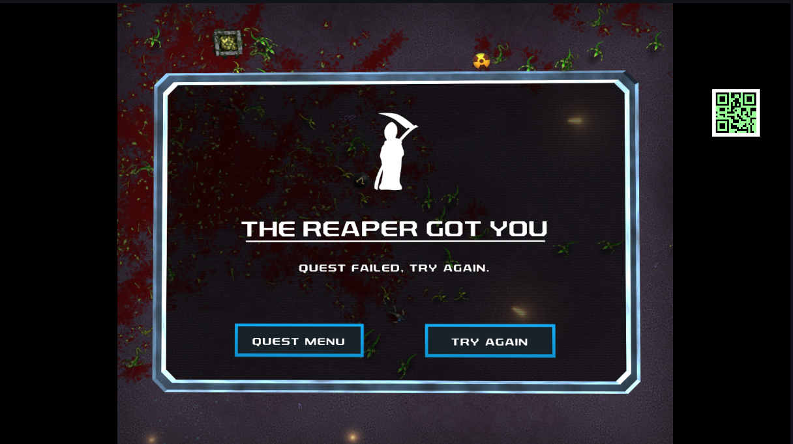

# QRCode Generator/Tracker for Intiface Sync Over Video

Ever wanted to stream while using Intiface Central and let your viewers feel what you're feeling?

Now you can!

## Overview

The premise is fairly simple. The streamer uses an OBS Browser Overlay that generates a QRCode based on commands sent to a simulated device in Intiface Central. This QRCode is then shown somewhere in their video stream. 

Meanwhile, viewers use one of the multiple capture methods provided to scrape the stream and interpret the QRCode, allowing them to follow the haptic action as it happens, in sync with the video stream.

The project is consists of 2 parts:

- An OBS Browser Widget that will connect to the _Websocket Device Manager_ in [Intiface
  Central](https://intiface.com/central). This widget acts as a simulated device for [Intiface
  Central](https://intiface.com/central), and will generate a barcode image which can be used as a
  video overlay.
- Multiple ways for viewers to track QRCodes with in a video and have the commands relayed to [Intiface Central](https://intiface.com/central)
  - A WebRTC based screen capture system
    - This system can be used with no modifications to the browser
  - **\[Coming Soon\]** A userscript for use with Greasemonkey/[Tampermonkey](https://www.tampermonkey.net/)/etc 
  - **\[Coming Soon\]** A browser extension for firefox/chrome

**No downloads are required to start using this system, for either the streamer or viewer.** The Browser Widget and WebRTC based screen capture system are both hosted via this github repo. The only reason this repo needs to be cloned is for development or forking purposes, but we'll be doing out best to provide customization capabilities.

## Streamer Instructions

## Viewer Instructions

## License

The QRCode Generator/Tracker project is released as under the BSD 3-Clause License. See [LICENSE](LICENSE) for more info.

The project is distributed with a prebuilt version of node-qrcode v1.5.4, with the following MIT license:

The MIT License (MIT)

Copyright (c) 2012 Ryan Day

Permission is hereby granted, free of charge, to any person obtaining a copy of this software and
associated documentation files (the "Software"), to deal in the Software without restriction,
including without limitation the rights to use, copy, modify, merge, publish, distribute,
sublicense, and/or sell copies of the Software, and to permit persons to whom the Software is
furnished to do so, subject to the following conditions:

The above copyright notice and this permission notice shall be included in all copies or substantial
portions of the Software.

THE SOFTWARE IS PROVIDED "AS IS", WITHOUT WARRANTY OF ANY KIND, EXPRESS OR IMPLIED, INCLUDING BUT
NOT LIMITED TO THE WARRANTIES OF MERCHANTABILITY, FITNESS FOR A PARTICULAR PURPOSE AND
NONINFRINGEMENT. IN NO EVENT SHALL THE AUTHORS OR COPYRIGHT HOLDERS BE LIABLE FOR ANY CLAIM, DAMAGES
OR OTHER LIABILITY, WHETHER IN AN ACTION OF CONTRACT, TORT OR OTHERWISE, ARISING FROM, OUT OF OR IN
CONNECTION WITH THE SOFTWARE OR THE USE OR OTHER DEALINGS IN THE SOFTWARE.